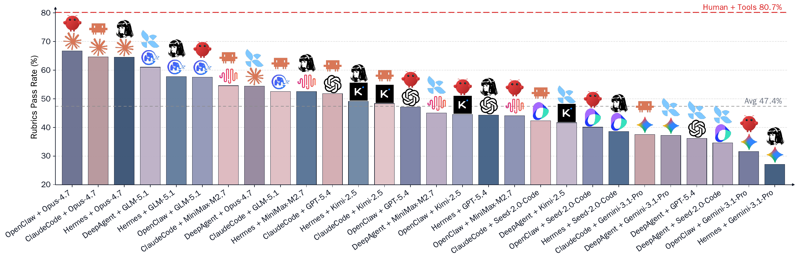

<div align="center">
  
</div>

<div align="center">
  <h1>Workspace-Bench</h1>
  <h3>Benchmarking AI Agents on Workspace Tasks with Large-Scale File Dependencies</h3>
</div>

<div align="center">
  <a href="https://workspace-bench.github.io/">
    
  </a>
  <a href="https://huggingface.co/datasets/Workspace-Bench/Workspace-Bench">
    
  </a>
  <a href="https://huggingface.co/datasets/Workspace-Bench/Workspace-Bench-Lite">
    
  </a>
  <a href="https://arxiv.org/abs/2605.03596">
    
  </a>
</div>

<!-- <div align="center">
  <a href="#overview">Overview</a> •
  <a href="#leaderboard">LeaderBoard</a> •
  <a href="#dataset-introduction">Dataset Introduction</a> •
  <a href="#quick-start">Quick Start</a> •
  <a href="#arxiv-link">arXiv</a>
</div> -->

<br />

## 📰 News
* **[May 07, 2025]**: The full datasets of Version 1.0 are released ([homepage](https://workspace-bench.github.io/), [huggingface](https://huggingface.co/datasets/SWE-bench/SWE-bench_Multimodal))!

## 👋 Overview

Workspace-Bench is a benchmark for evaluating AI agents on **workspace tasks with large-scale file dependencies**. It is built to study a capability we call **Workspace Learning**: whether an agent can identify, reason over, exploit, and update explicit and implicit dependencies among heterogeneous files in a real worker's workspace.

<div align="center">
  
</div>

<!-- Unlike benchmarks that either place all information directly in the prompt or provide a small bundle of task-specific files, Workspace-Bench evaluates agents in realistic workspaces where they must independently explore directories, locate relevant evidence, understand cross-file relations, and produce correct deliverables. The benchmark is centered on real-world workplace behavior rather than isolated tool-use or single-file question answering. -->

<!-- The figure above illustrates the overall design of Workspace-Bench. Agents are placed into role-specific workspaces with realistic cross-file dependent tasks, and are evaluated with capability-oriented rubrics that measure not only final correctness but also the ability to navigate complex workspace structure and file relations. -->

## 💫 LeaderBoard

<div align="center">
  
</div>

Rubric pass rates on Workspace-Bench-Lite across multiple combinations of agent harnesses and backbone [See Details](https://workspace-bench.github.io/leaderboard.html).

<!-- LLMs.
It highlights that strong foundation models matter, but harness design still plays a major role in efficiency, cost, and final performance.
Detailed leaderboard tables, per-model breakdowns, and additional analyses will be released together with the public benchmark release -->

## 💽 Dataset Introduction

Workspace-Bench contains:

<div align="center">
  
</div>

- **5** realistic worker profiles: Operations Manager, Logistics Manager, AI Product Manager, Researcher, and Backend Developer
- **74** file types across heterogeneous workspace environments
- **20,476** files, with workspaces scaling up to **20GB**
- **388** tasks, each paired with an explicit file dependency graph
- **7,399** fine-grained rubrics for evaluation
- **Workspace-Bench-Lite**, a 100-task subset that preserves the benchmark distribution while reducing evaluation cost by about **70%**


<!-- The distribution figure summarizes the current benchmark composition from several perspectives: file types, task abilities, task difficulty, workspace allocation, rubric counts, required files per task, and dependency edge counts. -->
<!-- These statistics reflect the diversity and complexity of Workspace-Bench and show that the benchmark is not limited to a single file format, workspace style, or task pattern. -->
<!-- In particular, Workspace-Bench covers multiple professional roles and difficulty levels, while preserving rich inter-file dependency structures that are essential for realistic workspace evaluation. -->

## 🚀 Quick Start

**Coming soon.**

We will release the dataset, evaluation pipeline, and example usage instructions for running agents on Workspace-Bench and Workspace-Bench-Lite.
The public release will include the necessary task assets, output specifications, and benchmarking scripts.

## 🔎 Publications
- [Workspace-Bench 1.0: Benchmarking AI Agents on Workspace Tasks with Large-Scale File Dependencies](https://arxiv.org/abs/2605.03596)


```bibtex
@misc{tang2026workspacebench10benchmarkingai,
      title={Workspace-Bench 1.0: Benchmarking AI Agents on Workspace Tasks with Large-Scale File Dependencies}, 
      author={Zirui Tang and Xuanhe Zhou and Yumou Liu and Linchun Li and Weizheng Wang and Hongzhang Huang and Jun Zhou and Jiachen Song and Shaoli Yu and Jinqi Wang and Zihang Zhou and Hongyi Zhou and Yuting Lv and Jinyang Li and Jiashuo Liu and Ruoyu Chen and Chunwei Liu and GuoLiang Li and Jihua Kang and Fan Wu},
      year={2026},
      eprint={2605.03596},
      archivePrefix={arXiv},
      primaryClass={cs.AI},
      url={https://arxiv.org/abs/2605.03596}
}
```

## 🤝 Acknowledgement

<p align="left">
  <a href="https://www.larksuite.com/" target="_blank">
    
  </a>
  &nbsp;&nbsp;&nbsp;&nbsp;
  <a href="https://www.sjtu.edu.cn/" target="_blank">
    
  </a>
</p>